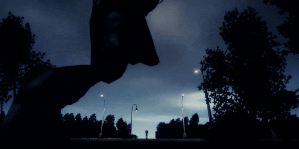

#### Technical Skills: Unity | C# | Python | Photoshop | Blender

## Experience

### Indie Game Developer · Self-employed
Nov 2023 - Present

### Game Tester · Self-employed ([YouTube](https://www.youtube.com/@KostazGaming))
Jul 2020 - Present
- Conduct thorough manual testing of various games, identifying and documenting issues to ensure high-quality gameplay.
- Leverage testing expertise to provide insightful commentary on game mechanics, graphics, and overall user experience in YouTube videos.
- Upload regular content to YouTube, monetizing the channel and 1.1M total views to date.
- Engage with the gaming community, fostering discussions and receiving feedback on tested games.

## Game Portfolio

### 🐇BUNNYHOP 2D
[Android Version - Play Store Link](https://play.google.com/store/apps/details?id=com.KostazStudio.BUNNYHOPv2) 

[WEBGL/Browser Version - Itch.io Link](https://kostazgamedev.itch.io/bunnyhop-2d)

[Demo Video]
<iframe width="560" height="315" src="https://www.youtube.com/embed/QJ-eTUWRbHY?si=m73N4n7Pmq8xsHsD" title="YouTube video player" frameborder="0" allow="accelerometer; autoplay; clipboard-write; encrypted-media; gyroscope; picture-in-picture; web-share" referrerpolicy="strict-origin-when-cross-origin" allowfullscreen></iframe>

- BUNNYHOP 2D introduces players to an exciting world where precision jumps and thrilling challenges await. In this version, you'll guide a determined bunny through a maze of obstacles, testing your skills and reflexes to the limit. With each carefully executed jump, you'll inch closer to your goal, immersed in an adrenaline-fueled adventure that rewards both precision and perseverance.

### 🔷LOFTY: Skybound Escape
[Android Version - Play Store Link](https://play.google.com/store/apps/details?id=com.KostazStudio.LOFTY)

[WEBGL/Browser Version - Itch.io Link](https://kostazgamedev.itch.io/lofty-skybound-escape?secret=QNAxYZlLycuQBOhiFxiI1rfAro)

[Demo Video]
<iframe width="560" height="315" src="https://www.youtube.com/embed/moQOE8iFMBM?si=9mujmbrOmb2cNeZr" title="YouTube video player" frameborder="0" allow="accelerometer; autoplay; clipboard-write; encrypted-media; gyroscope; picture-in-picture; web-share" referrerpolicy="strict-origin-when-cross-origin" allowfullscreen></iframe>

- Embark on a sky-high adventure in LOFTY: Skybound Escape! Maneuver through a series of obstacles, collect coins, and soar to new heights. Challenge your reflexes in this exciting 2D hypercasual game.

Features: 

🧩 Ad: Google Admob integrated for monetization

🧩 Shop: Unlockable characters/skins selection

### 🥚Eggbound 3D - Multiplayer
Modeled and animated the egg character and skins from scratch using Blender.

### 👻Echoes of the Lost
A first-person 3D psychological horror game. Players explore a haunted mansion as Hugo, a child searching for his brother, encountering jumpscares, solving puzzles, and unraveling dark secrets. The game blends tense exploration with emotional storytelling as Hugo faces both external dangers and his own inner guilt.
- Development in Progress

